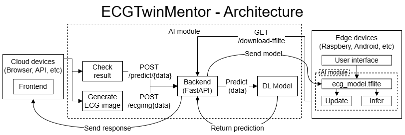
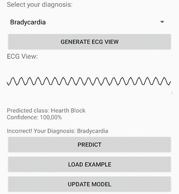
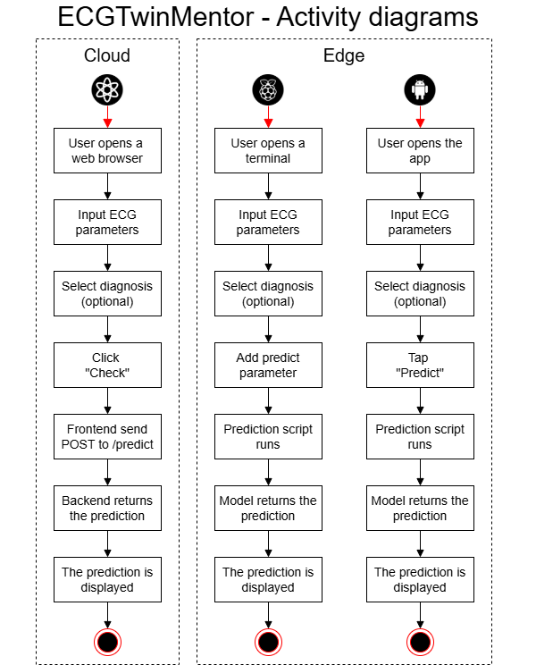
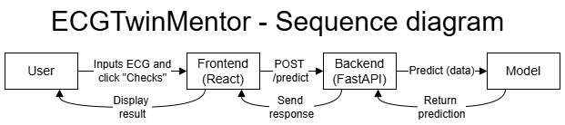

# ECGTwinMentor 🫀

ECGTwinMentor simulates a digital twin of an ECG diagnostic system. Users can input or generate ECG parameters, choose a diagnosis they believe is correct, and compare it with a prediction generated by a trained machine learning model.

---

## Version


This is the first complete and stable release of ECGTwinMentor, including all components:
- Web-based deployment (React + FastAPI)
- Android application (Kotlin + TensorFlow Lite)
- Raspberry Pi script (Python + TFLite Runtime)

Version 1.0.0 consolidates the architecture, machine learning model, and multiplatform deployment strategy for educational and predictive use of ECG data.

---

## 🧩 Architecture

The following diagram illustrates the overall architecture of the ECGTwinMentor system, covering both cloud and edge deployments:



ECGTwinMentor simulates a digital twin of an ECG diagnostic system. Users can input or generate ECG parameters, select a diagnosis they believe is correct, and compare it with a prediction generated by a trained machine learning model.

The system is designed to be deployed flexibly in both **cloud environments** (via web applications) and **edge devices** (such as Android smartphones or Raspberry Pi), enabling both connected and fully offline use cases.

### Main Components

- **Frontend (Cloud)**: A web interface (React) that allows users to input ECG parameters, request predictions, and generate ECG waveform visualizations. It communicates with the backend via RESTful POST requests.

- **Backend (FastAPI)**: The backend service receives user inputs, invokes the prediction model, and returns the results. It also provides endpoints for generating ECG images and serving model updates to edge devices.

- **AI Module (DL Model)**: A deep learning model trained to classify common cardiopathies. It is used both in the cloud (via FastAPI) and on edge devices (converted to TensorFlow Lite format).

- **Edge Devices (Raspberry Pi, Android)**: Local applications that embed the TFLite model for fast, offline inference. These apps support ECG parameter input, local prediction, and model updates via a defined endpoint.

This hybrid architecture ensures accessibility, responsiveness, and adaptability across a range of deployment scenarios, particularly in educational environments with limited infrastructure.


---

## 📁 Project Structure

The project is organized into the following main directories:

```
ECGTwinMentor/
├── cloud/                    → Web-based deployment (React + FastAPI)
│   ├── frontend/             → React frontend application
│   └── backend/              → FastAPI backend API with ML model
├── edge/                     → Edge deployments for offline use
│   ├── android/              → Android app (Kotlin + TensorFlow Lite)
│   └── raspberry/            → Raspberry Pi script for local inference
├── model/                    → Trained model files and conversion tools
│   ├── ecg_model.h5          → Original Keras model
│   └── ecg_model.tflite      → Converted TFLite model
├── images/                   → Diagrams and illustrations
└── README.md                 → Project documentation
```

Each module is self-contained and can be independently tested or deployed depending on the target platform.

---

## 🚀 Features

ECGTwinMentor offers a comprehensive set of features designed for ECG education, simulation, and AI-powered prediction:

- **Digital Twin Architecture**: Replicates a real ECG environment in a digital, interactive form.
- **Deep Learning-Based Prediction**: A trained model classifies heart conditions based on standard ECG parameters.
- **ECG Simulation**: Generates synthetic ECG signals from custom user input to support learning and interpretation.
- **Multi-Platform Support**: The system runs on web (cloud) and edge (Android, Raspberry Pi) environments.
- **Model Conversion and Deployment**: Includes scripts and tools to convert and deploy the trained model as TensorFlow Lite for edge devices.
- **Student Self-Assessment**: Allows users to select their own diagnosis and compare it with the system’s prediction.
- **Offline Inference**: Edge deployments enable use without internet connection.
- **Model Update Mechanism**: Supports remote downloading and replacement of the model in both Android and Raspberry Pi setups.

---

## 🧪 ECG Parameters Considered

ECGTwinMentor processes a set of key ECG parameters as input to simulate and predict heart conditions. These parameters are commonly used in clinical analysis and ECG interpretation.

| Parameter           | Description                                                           | Example Values         |
|---------------------|------------------------------------------------------------------------|------------------------|
| `Heart_Rate`        | Number of heartbeats per minute (BPM).                                | 60–100 BPM             |
| `PR_Interval`       | Time between atrial and ventricular depolarization.                   | 120–200 ms             |
| `QRS_Duration`      | Duration of ventricular depolarization.                               | 80–120 ms              |
| `ST_Segment`        | Represents the interval between ventricular depolarization and repolarization. | -0.5 to 2.0 mV     |
| `QTc_Interval`      | Corrected QT interval, adjusted for heart rate.                       | 350–450 ms             |
| `Electrical_Axis`   | Direction of electrical depolarization through the ventricles.        | -30° to +90°           |
| `Rhythm`            | Type of cardiac rhythm. Categorical value.                            | Sinus, Bradycardia, Tachycardia, Atrial Fibrillation |
| `T_Wave`            | Morphology of the T wave. Categorical value.                          | Normal, Inverted, Peaked, Flattened |

These parameters are used both for simulating realistic ECG signals and for feeding the AI model to predict potential cardiopathies.

---

## 🛠️ Deployment Options

ECGTwinMentor has been designed to support flexible deployment across multiple environments, enabling both online (cloud) and offline (edge) usage. This multiplatform capability allows the system to adapt to various educational and technical contexts.


### ☁️ Cloud Computing

#### ⚙️ Requirements

To deploy and run ECGTwinMentor in a cloud environment, the following components and versions are recommended:

- **Node.js** ≥ 16.x (for the React frontend)
- **Python** ≥ 3.8 (for the FastAPI backend)
- **pip** and **virtualenv** (for backend dependency management)
- **TensorFlow** ≥ 2.10 (to support model handling and inference)
- **Docker** *(optional)* for containerized deployment
- A server or cloud provider (e.g., AWS, GCP) to host frontend and backend components

#### 📦 Installation

Clone the repository and navigate to the `cloud` directory:

```
git clone https://github.com/your-repo/ECGTwinMentor.git
cd ECGTwinMentor/cloud
```

##### 🌐 Frontend

The frontend is developed using **React**, providing an interactive web interface that allows users to:

- Input ECG parameters manually or generate examples
- Trigger predictions using the backend AI model
- Visualize ECG waveform simulations
- Compare user-selected diagnoses with model output

It communicates with the backend via **REST API** and is designed to be lightweight, responsive, and intuitive for educational use.

The frontend is located in the `cloud/frontend/` directory and can be run in development mode locally or deployed to a static hosting service such as AWS Amplify, Netlify, or Vercel.

```
cd frontend
npm install
npm run dev
```

This will start the frontend on http://localhost:3000

##### 🧠 Backend

The backend is implemented using **FastAPI**, a modern Python framework for building APIs. It serves as the core of the system’s logic and includes:

- An endpoint for ECG prediction using the trained deep learning model
- Utilities for parameter validation and response formatting
- TFLite model handling for fast and efficient inference
- Support for CORS to enable communication with the frontend

The backend is located in the `cloud/backend/` directory and is launched using `uvicorn`. It exposes REST endpoints that the frontend uses to request predictions and manage interactions.

```
cd backend
python -m venv venv
source venv/bin/activate
pip install -r requirements.txt
uvicorn main:app --reload
```

The backend API will be available at http://localhost:8000. By default, it serves on port `8000` and can be deployed to cloud providers such as AWS EC2, Azure App Service, or Google Cloud Run.

### 📱 Edge Computing

ECGTwinMentor can also be deployed on edge devices to support offline, low-latency usage scenarios (Raspberry Pi and Android). This is especially useful in educational contexts where connectivity is limited or when rapid, local execution is needed.


#### 🧪 Model Conversion

To enable efficient inference on edge devices, the original deep learning model trained with Keras is converted into TensorFlow Lite format (`.tflite`).

The conversion process involves:

1. **Training** a standard `.h5` model using Keras.
2. **Converting** the model to `.tflite` using TensorFlow’s built-in converter:
   ```python
   import tensorflow as tf
   model = tf.keras.models.load_model('ecg_model.h5')
   converter = tf.lite.TFLiteConverter.from_keras_model(model)
   tflite_model = converter.convert()
   with open('ecg_model.tflite', 'wb') as f:
       f.write(tflite_model)
   ```
3. **Deploying** the `.tflite` model to:
   - `edge/android/app/src/main/assets/` (Android app)
   - `edge/raspberry/` (Raspberry Pi script)

The model preserves input shape and supports 8 features including numerical and categorical parameters. It is optimized for fast execution on mobile and embedded devices.

#### 🍓 Raspberry Pi

This edge deployment runs a local Python script on a Raspberry Pi device to perform ECG predictions using the TensorFlow Lite model.

##### ⚙️ Requirements

- Raspberry Pi OS with Python ≥ 3.7
- `tflite_runtime` installed (lightweight TensorFlow interpreter)
- `numpy`, `requests`, `argparse` (standard Python packages)
- Internet connection only required for optional model updates

Install dependencies:
```
python3 -m venv venv
source venv/bin/activate
pip install tflite_runtime numpy requests
```

##### 📖 User Guide

1. Place the `ecg_model.tflite` file in the Raspberry Pi script directory.
2. Run predictions using command-line arguments with ECG values.
3. Update the model remotely with the `update` command.

The script `predict_ecg_edge.py` supports three commands:

##### 1. Predict

Make a prediction with ECG parameters:

```bash
python predict_ecg_edge.py predict \
  --hr 69.8 \
  --pr 172.8 \
  --qrs 106.9 \
  --st 0.81 \
  --qtc 376.3 \
  --axis 33.6 \
  --rhythm Bradycardia \
  --t_wave Normal
```

Output:
```bash
Predicted class: Bradycardia
Confidence: 87.42%
```

##### 2. Update

Update the local model by downloading it from the backend:

```bash
python predict_ecg_edge.py update --url http://localhost:8000/download-tflite
```

- The previous model is backed up with a timestamp.
- The downloaded model is validated before replacing the original.
- All operations are logged.

##### 3. Log
Display the update log history:

```bash
python predict_ecg_edge.py log
```
Sample output:
```bash
📄 Model Update Log:
[2025-04-02 18:00:12] [OK] Model updated from http://localhost:8000/download-tflite | Backup: ecg_model_backup_20250402_180012.tflite
```

#### 📋 Summary of Commands

| Command                         | Description                                     | Example                                                                 |
|--------------------------------|-------------------------------------------------|-------------------------------------------------------------------------|
| `predict`                      | Make a prediction from ECG parameters           | `python predict_ecg_edge.py predict --hr 75 --pr 160 ...`              |
| `update`                       | Download and replace the local model            | `python predict_ecg_edge.py update`                                     |
| `log`                          | Display update history of downloaded models     | `python predict_ecg_edge.py log`                                        |

#### 📱 Android

The Android version of ECGTwinMentor provides a lightweight, mobile-friendly interface for ECG parameter input, simulation, and on-device prediction using TensorFlow Lite.

 

##### ⚙️ Requirements

- Android Studio (Flamingo or newer)
- Kotlin ≥ 1.8
- Minimum SDK: 23
- Target SDK: 33
- Gradle plugin ≥ 7.2
- TensorFlow Lite runtime included as a dependency

Dependencies to include:
```
implementation 'org.tensorflow:tensorflow-lite:2.13.0'
implementation 'com.google.android.material:material:1.8.0'
```

##### ✨ Features

- Manual input of ECG parameters
- Dropdowns for Rhythm and T Wave types
- Local prediction using embedded `.tflite` model
- Visual ECG waveform simulator
- Student self-diagnosis with result comparison
- Button to load randomized realistic examples
- Button to update the model from a remote server

##### 📖 User Guide

1. Open the app and enter ECG parameter values or press "Load Example".
2. Choose Rhythm and T Wave from the dropdown menus.
3. Select your own diagnosis (for self-assessment).
4. Press "Predict" to get the class and confidence from the model.
5. Press "Generate ECG View" to visualize the waveform.
6. Press "Update Model" to fetch the latest `.tflite` file from a server URL.

The model is stored in `assets/` and is used directly on the device, supporting full offline functionality once deployed.

---

## 📊 UML Diagrams

### Activity Diagram

This diagram outlines the user's flow from opening the web app to receiving feedback:



---

### Sequence Diagram

This diagram shows interactions between user, frontend, backend, and model:



---

## 📄 License

This project is licensed under the **Creative Commons Attribution-NonCommercial 4.0 International (CC BY-NC 4.0)** license.

You are free to:
- Share — copy and redistribute the material in any medium or format
- Adapt — remix, transform, and build upon the material

Under the following terms:
- **Attribution** — You must give appropriate credit.
- **NonCommercial** — You may not use the material for commercial purposes.

For full details, see the [license summary](https://creativecommons.org/licenses/by-nc/4.0/) or the [full legal text](https://creativecommons.org/licenses/by-nc/4.0/legalcode).

---

## 👤 Authors

This project was developed by:

 - Daniel Flores-Martin: [dfloresm@unex.es](mailto:dfloresm@unex.es)
 - Francisco Díaz-Barrancas: [frdiaz@unex.es](mailto:frdiaz@unex.es)
 - Javier Berrocal: [jberolm@unex.es](mailto:jberolm@unex.es)
 - Pedro J. Pardo: [pjpardo@unex.es](mailto:pjpardo@unex.es)
 - Juan M. Murillo: [juanmamu@unex.es](mailto:juanmamu@unex.es)

This work is part of a broader research initiative focused on digital twins and AI-driven education tools in healthcare, particularly cardiology.

For more information, collaborations, or academic references, please contact the author.


